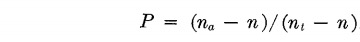
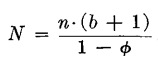
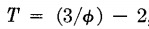
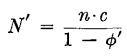
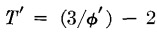
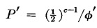
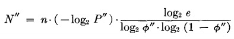
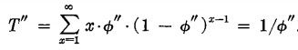
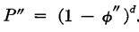
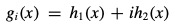

# Bloom Filter

本文仅为个人调研总结，如有发现错误，请斧正。

## 简介

Bloom Filter 由 Burton H. Bloom 在 1970 年的论文 [1] 中被首次提出，用于解决 membership 问题，即检测某数据 s 是已知集合 S 的成员。

### 问题界定

给定一个数据集合 S，检测新的数据 d 是否是集合 S 的成员。这里需要考虑的计算因素 (computational factors) 包括：

* 数据集合 S 所占用的存储空间（内存、外存）
* 成员检测所需时间
* False Positive Rate (FPR)，即认定属于集合 S，实际上不是的比例

其中 FPR 的计算公式为：



* n_a：将被判定为成员的数据总数
* n_t：数据总数
* n：集合 S 中的数据总数

### 解决方案

#### 1. 传统解法

假设数据集合 S 中有 n 条数据，那么我们需要新建一个大小为 h (h > n) 的哈希表，表中每个元素的大小不定。假设 S 中某条数据 s 的大小为 b bits，那么将其存入哈希表中将占用 b+1 bits空间，多出的 1 bits用于判定该位置是否为空。

**初始化哈希表过程**：将每条数据 s 输入哈希函数，生成 [0,  h-1] 中的某个数，即为 s 将被放入的位置，若该位置为空，则直接放入；否则继续生成一个新的位置，直到找到空位置为止 (解哈希冲突)。伪码如下：

```js
function add(s) {
	times = 1
	pos = hash(s, seed, times)
	while S[pos] != nil {
		times += 1
		pos = hash(s, seed, times)
	}
	S[pos] = s
}
```

**成员检测过程**：将新数据 s 输入哈希函数，生成对应的位置，若该位置为空，则判定 s 不属于 S；若位置不空且数据与 s 相等，则判定 s 属于 S，若位置不空且数据与 s 不等，则继续生成新位置，直到可以判定为止。伪码如下:

```js
function check(s) {
	times = 1
	pos = hash(s, seed, times)
	while S[pos] != nil && S[pos] != s {
		times += 1
		pos = hash(s, seed, times)
	}
	return S[pos] == s
}
```

#### 2. 长数据转短数据

方案 2  与方案 1 思路类似，只是在写入哈希表前，会将长度为 b 的数据压缩成定长为 c 的数据，从而减少空间占用量。方案 2 实际上在两个步骤中使用了哈希函数：

* 哈希寻址
* 缩短数据

哈希函数避免不了会遇到冲突问题，缩短数据时，哈希函数可能将两条长数据编码成相同的短数据，导致在成员检测过程出现 false positive 误判。

#### 3. Bloom Filter

方案 3 与方案 1、2 的思路截然不同：首先初始化一个 BitSet，所有 bit 都置 0。

**初始化哈希表过程**：利用 k 个相互独立的哈希函数，为 S 中的每条数据找到 d 个 bit 位，并分别将 BitSet 中的这些位置为 1。伪码如下：

```js
function add(s) {
  for i = 0; i < k; i++ {
    p = hashFuncs[i].hash(s)
    BitSet[p] = 1
  }
}
```

**成员检测过程**：利用同样的 k 个相互独立的哈希函数，为新数据 s 找到 d 个 bit 位，并分别检测这些位置是否为 1，若存在为 0 的位，则判定 s 不在集合中。伪码如下：

```js
function check(s) {
  for i = 0; i < k; i++ {
    p = hashFuncs[i].hash(s)
    if BitSet[p] == 0 {
      return false
    }
  }
  return true
}
```

### 方案评价

论文 [1] 从 3 个维度上对比了以上 3 个方案：

| 方案              | 空间                                                     | 时间                                                         | FPR                                                  |
| ----------------- | -------------------------------------------------------- | ------------------------------------------------------------ | ---------------------------------------------------- |
| 1. 传统方案       |  |  | 0                                                    |
| 2. 长数据转短数据 |  |  |  |
| 3. Bloom Filter   |  |  |  |

注：φ 表示哈希表的空置率，1 - φ 则表示负载率。详细分析和对比请查阅论文 [1]。

总结如下：

* 方案 1 占用空间最大，但 FPR 为 0，正确性有保证
* 方案 2 和方案 3 牺牲 FPR 换取空间，在相同 FPR 下，方案 3 的 space/time tradeoff 表现要优于方案 2

## 实现 Bloom Filter

本项目实现了一个简版 bloom filter，包括 BitSet 和 BloomFilter 两个组件。

### BitSet

我们可以用 byte 数组来模拟 BitSet，支持 Set 和 HasSet 两个方法：

```go
type BitSet []byte

func (m BitSet) Set(index uint64) {
	skips, offset := index/elemLen, index%elemLen
	m[skips] = m[skips] | (uint8(1) << (elemLen - offset - 1))
}

func (m BitSet) HasSet(index uint64) bool {
	skips, offset := index/elemLen, index%elemLen
	return m[skips]&(uint8(1)<<(elemLen-offset-1)) > 0
}
```

### BloomFilter

论文 [2] 证明了可以利用两个相互独立的哈希函数组合成任意数量的哈希函数来构建 bloom filter：



本项目选取 crypto 中的两个速度 较快的哈希函数 md5 和 sha1 作为 base hash function：

```go
func h1(key string) uint64 {
	hash := sha1.Sum([]byte(key))
	val, _ := strconv.ParseUint(hex.EncodeToString(hash[:8]), 16, 64)
	return val
}

func h2(key string) uint64 {
	hash := md5.Sum([]byte(key))
	val, _ := strconv.ParseUint(hex.EncodeToString(hash[:8]), 16, 64)
	return val
}
```

构建 bloom filter：

```go
type BloomFilter struct {
	kHash  int
	bitset BitSet
}

func (m *BloomFilter) hashToIndex(key string, ki uint64) uint64 {
	return (h1(key) + h2(key)*ki) % uint64(len(m.bitset)*elemLen)
}

func (m *BloomFilter) AddKey(key string) {
	for i := 0; i < m.kHash; i++ {
		hi := m.hashToIndex(key, uint64(i))
		m.bitset.Set(hi)
	}
}

func (m *BloomFilter) HasKey(key string) bool {
	for i := 0; i < m.kHash; i++ {
		hi := m.hashToIndex(key, uint64(i))
		if !m.bitset.HasSet(hi) {
			return false
		}
	}
	return true
}
```

逻辑基本与伪码一致。

## 参考

##### Papers

1. [Space/Time Trade-offs in Hash Coding with Allowable Errors](https://people.cs.umass.edu/~emery/classes/cmpsci691st/readings/Misc/p422-bloom.pdf)[Less Hashing, Same Performance: Building a Better Bloom Filter](https://www.eecs.harvard.edu/~michaelm/postscripts/rsa2008.pdf)
2. [Less Hashing, Same Performance: Building a Better Bloom Filter](https://www.eecs.harvard.edu/~michaelm/postscripts/rsa2008.pdf)

##### Blogs

* [Bloom Filters: Is element x in set S?](https://www.abhishek-tiwari.com/bloom-filters-is-element-x-in-set-s/)

##### Projects

* [github.com/willf/bloom](https://github.com/willf/bloom)
* [github.com/steakknife/bloomfilter](https://github.com/steakknife/bloomfilter)
* [github.com/zentures/bloom](https://github.com/zentures/bloom)